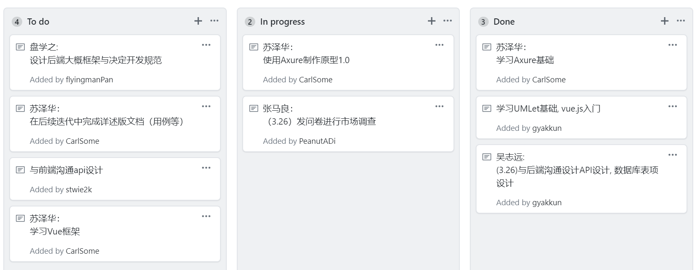

## Homework 2
### 1. 用简短的语言给出对分析、设计的理解。
分析与设计就是将需求进行具体化,具象化,流程化,然后提取其有价值的内容进行具体设计和分析,最终得到产品

### 2. 用一句话描述面向对象的分析与设计的优势。
其实现的最终结果是面向用户的,其实现过程也是更符合人类思考的方式,使得开发过程较为简单

### 3. 简述 UML（统一建模语言）的作用。考试考哪些图？
UML主要用于说明、可视化、构建和编写一个正在开发的、面向对象的、软件密集系统的制品  
考试主要考察:用例图、静态图(类图、对象图、包图)、行为图(交互图（循序图、合作图），状态图，活动图)、实现图(构件图、部署图)

### 4. 从软件本质的角度，解释软件范围（需求）控制的可行性
软件开发的过程并不是固定和一成不变的,这样导致了开发过程中的变化造成的开发难度增大,甚至导致了项目失败.  
故范围/需求的控制就不仅需要在创立项目或者更改需求时要有详细的评审,而且还需要又风险对应的措施,尽可能减少其带来的影响,如引入冗余时间等措施

## 看板
- 看板内容如图
此看板为前期启动时期看板,未分项目单独列出内容
