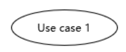
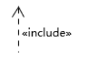

## Homework 4
### 1.简答题
1. 用例的概念
- 针对用户在某个情景下进行某种操作的描述
2. 用例和场景的关系?什么是主场景或 happy path?
- 场景是客户和系统的交互
- 场景是实例化的用例
- 主场景指的是经常出现的场景
- happy path指的是能顺利完成业务逻辑的一条操作路径
3. 用例有哪些形式?
- 摘要
- 非正式
- 正式
4. 对于复杂业务，为什么编制完整用例非常难?
- 因业务中可能出现前期编写时无法预估到的情景或者意外,也受限于开发时间,故出现后期才能从实践中补充完整整个用例
5. 什么是用例图?
- 用例图就是一种用图表来进行具象化或者便于理解的用例描述,能形象表达用例的核心逻辑.
6. 用例图的基本符号与元素?
- 用户  
  
- 用例  
  
- 包含关系    

- 拓展关系  

- 泛化关系  

- 关联关系  

7. 用例图的画法与步骤
- 确定参与者:明确参与者,并绘制其代表形象
- 确定用例: 明确系统各个用例,并令其都具有确定的交互关系,再确定用例之间的关系
- 泛化接口:提供接口
8. 用例图给利益相关人与开发者的价值有哪些?
- 明确了业务的流程,使开发者更好地理解系统的工作方式和流程,令开发过程更为明确
- 让有关人员能迅速熟悉该系统的交互方式

### 2,建模练习题（用例模型）

选择2-3个你熟悉的类似业务的在线服务系统（或移动 APP），如定旅馆（携程、去哪儿等）、定电影票、背单词APP等，分别绘制它们用例图。并满足以下要求：
- 请使用用户的视角，描述用户目标或系统提供的服务
- 粒度达到子用例级别，并用 include 和 exclude 关联它们
- 请用色彩标注出你认为创新（区别于竞争对手的）用例或子用例
- 尽可能识别外部系统和服务  

然后，回答下列问题：
1. 为什么相似系统的用例图是相似的?
- 因为相似系统业务逻辑往往相似,而为其做出来的用例图故相似,其系统的不同点基本在于界面的不同而不是业务逻辑层面的不同
2. 如果是定旅馆业务，请对比 Asg_RH 用例图，简述如何利用不同时代、不同地区产品的用例图，展现、突出创新业务和技术
- 对客户中最后的支付采取简化措施,引导使用简便支付方式
3. 如何利用用例图定位创新思路（业务创新、或技术创新、或商业模式创新）在系统中的作用
- 绘制新的用例图,对比旧用例图可以得到创新的地方和流程好坏的对比
4. 请使用 SCRUM 方法，选择一个用例图，编制某定旅馆开发的需求（backlog）开发计划表
5. 根据任务4，参考 使用用例点估算软件成本，给出项目用例点的估算
